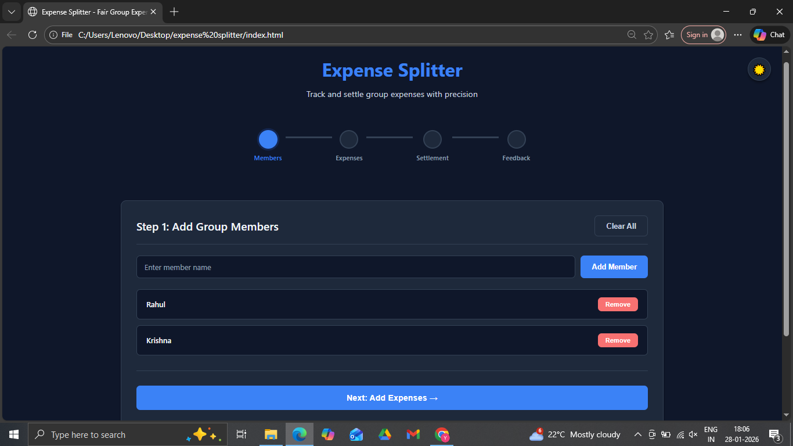
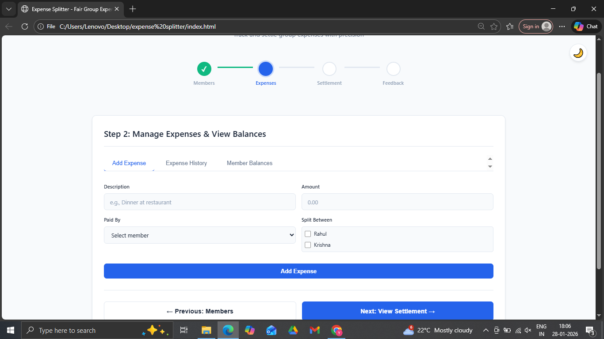
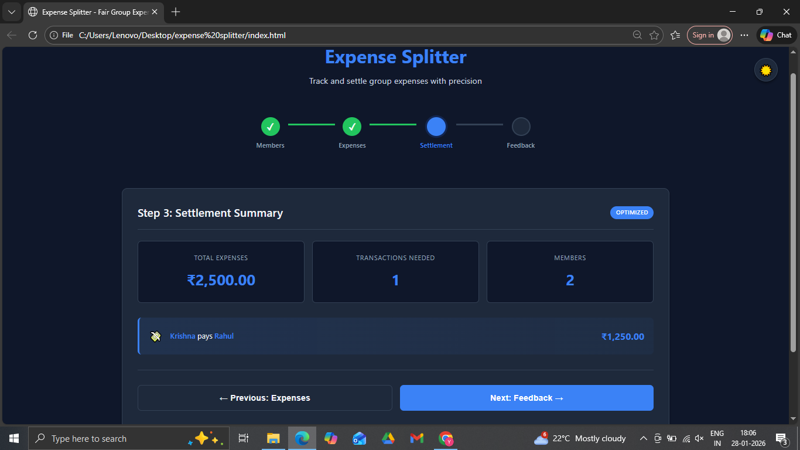
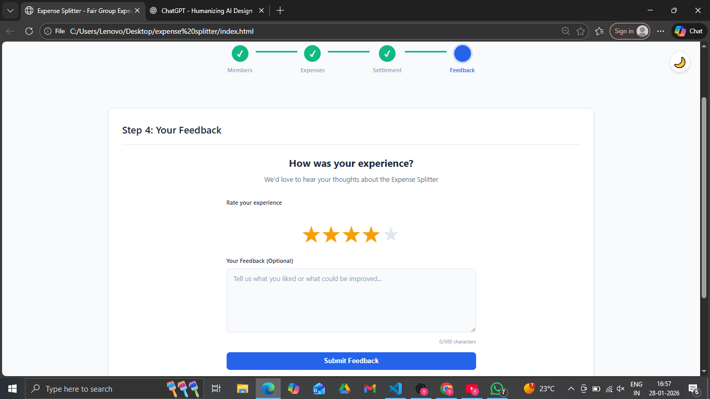

# Expense Splitter-Track and settle group expenses with precision

## Description
Expense Splitter is a frontend-only web application that helps groups split expenses fairly with precision.  
Users can add group members, record expenses, and automatically calculate balances and settlements.

This project is built using **HTML, CSS, and JavaScript**, with data persistence using **localStorage**.

---

## Features
- Add and remove group members
- Add expenses with:
  - Description(Expense name)
  - Amount
  - Person who paid(Paid By)
  - Split between(Members Involved)
- Automatically calculates:
  - Total amount spent by each member
  - Net balance (who owes / who gets)
  - Settlement suggestions
  - Feedback 
- Dark mode toggle
- Data persists on page refresh using localStorage

---

## Technologies Used
- HTML
- CSS
- JavaScript
- Font Awesome (for icons)

---

## How to Run the Project
1. Clone or download the repository
2. Open `index.html` in any modern browser
3. No backend or server required

---

## Screenshots
_Add screenshots of the application here_

---

## Author
- Name: Yaswanth Srisailapu
- Institute: IIT Indore
